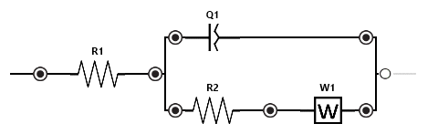

# Equivalent Circuit Fitting

[pypalmsens.fitting.CircuitModel][] fits the equivalent circuit specified with the CDC descriptor code.
Optional settings are fixing the value of a parameter, setting the min/max bounds for a parameter,
specifying the frequency range to fit, limiting the number of iterations, delta error term or delta parameter term.

Example usage for fitting an equivalent circuit:

```pycon
>>> import pypalmsens as ps

>>> measurements = ps.load_session_file('examples/Demo CV DPV EIS IS-C electrode.pssession')
>>> eis_data = measurements[2].eis_data[0]

>>> cdc = 'R(RC)'
>>> model = ps.fitting.CircuitModel(cdc=cdc)
>>> result = model.fit(eis_data)
>>> result
FitResult(cdc='R(RC)', parameters=[134.2601648341703, 11839.397430811792, 4.763069310462662e-07], error=[...], ...)

```

`result` is an instance of [pypalmsens.fitting.FitResult][], a dataclass with fit values, errors, and other fitting data:

```pycon
>>> result.cdc
'R(RC)'

>>> result.parameters
[134.2601648341703, 11839.397430811792, 4.763069310462662e-07]

>>> result.error
[2.3519772735560074, 2.466430045381699, 2.7610107312609493]

>>> result.n_iter
19

>>> result.chisq
0.014493966401698677

>>> result.exit_code
'MinimumDeltaErrorTerm'

```

`CircuitModel` takes a single parameter, the circuit description code (CDC).
Note that the code must be in all caps. For more information, see the [CDC documentation](https://www.utwente.nl/en/tnw/ims/publications/downloads/cdc-explained.pdf).

You can pass `result.parameters` back to [pypalmsens.fitting.CircuitModel.fit][]) to redo the fit from different starting parameters:

```pycon
>>> model.fit(eis_data, parameters=result.parameters)
FitResult(cdc='R(RC)', parameters=[...], ...)

```

## Parameters

If you want to tune the parameters, like fixing values or setting bounds, you can set them using the [pypalmsens.fitting.Parameters][] class.
`model.default_parameters` grabs the default parameters for the CDC.

These can be modified, for example:

```pycon
>>> parameters = model.default_parameters()

>>> parameters[0].value = 123  # set starting value to 123
>>> parameters[0].fixed = True # fix this value
>>> parameters[1].min = 12  # set lower bound
>>> parameters[1].max = 34  # set upper bound

>>> model.fit(eis_data, parameters=parameters)
FitResult(cdc='R(RC)', parameters=[...], error=[...], ...)

```

## Re-fit EIS data

If you have already fitted your data in PSTrace, you can redo the fit or use the values as starting parameters:

```pycon
>>> model = ps.fitting.CircuitModel(cdc=eis_data.cdc)
>>> model.fit(eis_data, parameters=eis_data.cdc_values)
FitResult(cdc='R([RT]Q)', parameters=[...], error=[...], ...)

```

## Plotting

If you have [matplotlib](https://matplotlib.org) installed, you can
generate the plots from the result:

```pycon
>>> result.plot_nyquist(eis_data)
<Figure size 640x480 with 1 Axes>

>>> result.plot_bode(eis_data)
<Figure size 640x480 with 2 Axes>

```

## Default values

This table shows the default values, the element types used in the system. Note that some element types have multiple values.

For more information on the formulas, please see the chapter "Equivalent Circuit Fitting" in the [PSTrace user manual]().

| Element | Value | Min | Max | Units |
| :--- | :---: | :---: | :---: | :---: |
| **Resistance (R)**  | 1 × 10³ | 1 × 10⁻⁶ | 1 × 10¹² | Ω |
| **Capacitance (C)**  | 10 × 10⁻⁹ | 1 × 10⁻¹² | 1 × 10⁻³ | F |
| **Inductance (L)**  | 100 × 10⁻⁶ | 1 × 10⁻¹² | 1 × 10⁻³ | H |
| **Constant Phase Element (Q)** | | | | |
|  _Y0_                           | 1 × 10⁻³ | 1 × 10⁻¹² | 1 × 10⁻³ | T |
|  _Constant phase exponent n_    | 1 | 0 | 1 | σ |
| **Warburg (W)**  | 1 × 10³ | 1 × 10⁻⁶ | 1 × 10¹² | σ |
| **Warburg Open (T) / Short (O)** | | | | |
|  _Warburg coefficient_            | 1 × 10³ | 1 × 10⁻⁶ | 1 × 10¹² | σ |
|  _B_                              | 1 | 1 × 10⁻¹² | 1 × 10⁶ | √s |
|  _Experimental parameter_         | 0.5 | 0 | 1 | φ |
| **Gerischer (G)**                | | | | |
|  _Z0_                             | 1 × 10³ | 1 × 10⁻⁶ | 1 × 10¹² | Z₀ |
|  _k (reaction rate)_              | 1 | 1 × 10⁻¹² | 1 × 10⁶ | s⁻¹ |
| **Bisquert Open (M) / Short (N)** | | | | |
|  _Z pore_                                    | 100 | 1 × 10⁻⁶ | 1 × 10¹² | Ω |
|  _Reaction resistance_                      | 10 × 10³ | 1 × 10⁻⁶ | 1 × 10¹² | Ω |
|  _Pore diffusion CPE T_                     | 1 × 10⁻³ | 1 × 10⁻¹² | 1 × 10⁻³ | T |
|  _Pore diffusion CPE n_                     | 1 | 0 | 1 | Φ |
|  _Pore depth_                               | 1 | 0 | 1 × 10¹² | L |

## Impedance.py

`impedance.py` is a popular Python package for analyzingelectrochemical impedance spectroscopy (EIS) data.
It has a a straightforward, scikit-learn-like API for impedance analysis.

You can install `impedance.py` via `pip install impedance`.

For more information, see [the documentation](https://impedancepy.readthedocs.io/en/latest/index.html) or [source code on Github](https://github.com/ECSHackWeek/impedance.py).

From an eis data set, it is trivial to create the frequency and impedance data (`Z`) for `impedance.py` using numpy:

```python
import pypalmsens as ps
import numpy as np

measurement = ps.load_session_file('examples/Demo CV DPV EIS IS-C electrode.pssession')[2]

eis = measurement.eis_data[0]

frequencies = np.array(eis.dataset['Frequency'])
Zre = np.array(eis.dataset['ZRe'])
Zim = np.array(eis.dataset['ZIm'])

Z = Zre - 1j * Zim
```

For example, to fit this circuit model:

{ width="80%" }

We can use the circuit description: `'R0-p(R1-W1,CPE1)'`. This is different from the CDC codes used by PalmSens. You can read about [the available elements here](https://impedancepy.readthedocs.io/en/latest/circuit-elements.html).

The example below shows how to fit the circuit model to the data:

```python
import matplotlib.pyplot as plt
from impedance.models.circuits import CustomCircuit
from impedance.visualization import plot_nyquist

circuit = 'R0-p(R1-W1,CPE1)'

initial_guess = [1000, 1000, 1000, 0, 1]

circuit = CustomCircuit(circuit, initial_guess=initial_guess)

ret = circuit.fit(F, Z)

print(ret)

Z_fit = circuit.predict(F)

fig, ax = plt.subplots()
plot_nyquist(Z, fmt='o', scale=10, ax=ax)
plot_nyquist(Z_fit, fmt='-', scale=10, ax=ax)

plt.legend(['Data', 'Fit'])
plt.show()
```

This results in the plot below:

{ width="80%" }
