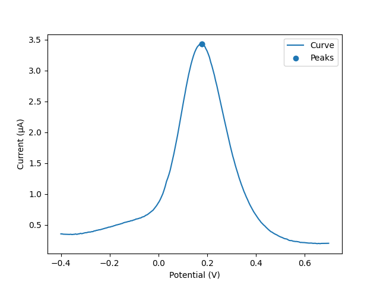

# Working with data

This page shows how to use `pypalmsens` to interface with your measurement data.

The [pypalmsens.data][] submodule contains wrappers for the PyPalmSens .NET SDK libraries.
These are the same libraries that power the [PSTrace](https://www.palmsens.com/software/ps-trace/) software.

## Measurement

```python
import pypalmsens as ps

measurements = ps.load_session_file('examples/Demo CV DPV EIS IS-C electrode.pssession')
print(measurements)
"""
[Measurement(title=Differential Pulse Voltammetry, timestamp=2017-07-12T14:28:58, device=PalmSens4), Measurement(title=Cyclic Voltammetry [1], timestamp=2017-07-12T14:33:10, device=PalmSens4), Measurement(title=Impedance Spectroscopy [2], timestamp=2017-07-12T14:48:42, device=PalmSens4)]
"""
```

A `.pssession` file always contains a list of measurements, so you can pick the first (DPV) one:

```python
measurement = measurements[0]
```

From there you can query the device info:

```python
print(measurement.device)
#> DeviceInfo(type='PalmSens4', firmware='', serial='PS4A16A000003', id=9)
```

As well as other measurement metadata:

```python
print(measurement.title)
#> Differential Pulse Voltammetry
print(measurement.timestamp)
#> 2017-07-12T14:28:58
print(measurement.channel) # (1)!
#> -1
```

1. For multichannel measurements

There are two ways to access the data.
`m.dataset` returns the raw data that were measured, analogous to the _Data_ tab in PSTrace.
`m.curves` returns a list of [Curve](#curve) objects, which represent the plots.

For more information, see the [pypalmsens.data.Measurement][].

## Curve

A measurement can contain multiple curves, this measurement has only 1 with 219 data points:

```python
curves = measurement.curves
print(curves)
#> [Curve(title=Curve, n_points=219)]
```

From here you can query some Curve metadata:

```python
curve = curves[0]
print(curve.title)
#> Curve
print(len(curve))
#> 219
print(curve.x_label, curve.x_unit)
#> Potential V
print(curve.y_label, curve.y_unit)
#> Current �A

```

Use the `.plot()` method to show a simple plot of the data.
This depends on [matplotlib](https://matplotlib.org/) being available.

```python
fig = curve.plot() # (1)!
fig.show()
```

1. This returns a [matplotlib.figure.Figure][].

This results in this plot:

{ width="80%" }

The data has a single peak stored in the measurement. You can retrieve it using:

```python
print(curve.peaks)
"""
[Peak(x=0.179102 V, y=3.42442 �A, y_offset=0.501758 �A, area=0.647762 V�A, width=0.201485 V)]
"""
```

To find the peak, use `.find_peaks()`:

```python
peaks = curve.find_peaks()
print(peaks)
"""
[Peak(x=0.179102 V, y=3.42442 �A, y_offset=0.26371 �A, area=0.818265 V�A, width=0.216563 V)]
"""
```

An alternative method for CV and LSV is available under `curve.find_peaks_semiderivative()`.
For more info on this algorithm, see [this Wikipedia page](https://en.wikipedia.org/wiki/Neopolarogram).

!!! NOTE "Peak finding"

    Depending on your data, the peak finder may not always find peaks on the first try.
    Sometimes the parameters need to be tuned, see [pypalmsens.data.Curve.find_peaks][] for more information.

You can do filtering using [pypalmsens.data.Curve.smooth][]. Note that this updates the curve in-place.

```python
curve.smooth(smooth_level=1)
```

Or alternatively using a [Savitsky-Golay filter](https://en.wikipedia.org/wiki/Savitzky%E2%80%93Golay_filter):

```python
curve.savitsky_golay(window_size=3)
```

To make your own plot or run your own data processing or analytics script,
the raw x and y data can be accessed through `curve.x_array` and `curve.y_array`.
These both return [DataArray](#dataarray) objects, which can be converted to floats or numpy arrays.

```python
print(curve.x_array)
#> DataArray(name=potential, unit=V, n_points=219)
print(list(curve.x_array)[:5]) # (1)!
"""
[
    0.687698,
    0.692698,
    0.697776,
]
"""
print(curve.y_array)
#> DataArray(name=current, unit=�A, n_points=219)

import numpy as np
print(np.array(curve.y_array)) # (2)!
#> array([0.352146, 0.351192, ..., 0.19908 , 0.199557])
```

1. Convert to list...
2. ...or numpy array

For more information, see [pypalmsens.data.Curve][].

## Peak

The peaks is a small dataclass containing peak propersies.

Stored peaks can be retrieved from a [Curve](#curve) (e.g. if PSTrace stored peaks in the `.pssession file).

```python
peaks = curve.peaks
peaks
# [Peak(x=0.179102 V, y=3.42442 µA, y_offset=0.26371 µA, area=0.818265 VµA, width=0.221563 V)]
```

Many peak properties are accessible from this object.

```python
peak = peaks[0]
print(peak.x, peak.y)
#> (0.179102, 3.42442)
print(peak.width)
#> 0.2215
print(peak.area)
#> 0.8182
print(peak.left_x), peak.right_x
#> (-0.35465, 0.647385)
print(peak.value) # (1)!
#> 3.1607
```

1. The peak value is the height of the peak relative to the baseline

For more information, see [pypalmsens.data.Peak][].

## DataSet

The raw data are stored in a dataset. The dataset contains all the raw data, including the data for the curves.

```python
dataset = measurement.dataset
print(dataset)
#> DataSet(['Time', 'Potential', 'Current'])
```

A dataset is a mapping, so it acts like a Python dictionary:

```python
print(dataset['Time'])
#> DataArray(name=time, unit=s, n_points=219)
print(dataset['Potential'])
#> PotentialArray(name=potential, unit=V, n_points=219)
```

To list all arrays:

```python
print(dataset.arrays())
#> [DataArray(name=time, unit=s, n_points=219),
#>  PotentialArray(name=potential, unit=V, n_points=219),
#>  CurrentArray(name=current, unit=µA, n_points=219)]
```

Arrays of the same type can be retrieved through a method:

```python
print(dataset.arrays(type='Current'))
#> [CurrentArray(name=current, unit=µA, n_points=219)]
print(dataset.arrays(type='Potential'))
#> [PotentialArray(name=potential, unit=V, n_points=219)]
```

Datasets can be quite large and contain many arrays.
Therefore, arrays can be selected by name...

```python
print(dataset.array_names)
#> {'current', 'potential', 'time'}
print(dataset.arrays(name='time'))
#> [DataArray(name=time, unit=s, n_points=219)]
```

...quantity...

```python
print(dataset.array_quantities)
#> {'Current', 'Potential', 'Time'}
print(dataset.arrays(quantity='Potential'))
#> [PotentialArray(name=potential, unit=V, n_points=219)]
```

...or type:

```python
print(dataset.array_types)
#> {'Current', 'Potential', 'Time'}
print(dataset.arrays(type='Current'))
#> [CurrentArray(name=current, unit=µA, n_points=219)]
```

Type and quantity may seem similar, but for methods with many quantities the difference will be visible.
For example, in EIS 'miDC' and 'Iac' are different array types, but have the same quantity 'Current'.

Note that for larger datasets these methods can return multiple DataArrays.
Data from a _Cyclic Voltammetry_ measurement can contain multiple scans and
can therefore the dataset can contain multiple arrays per array type.

If you have [pandas](https://pandas.pydata.org/) installed,
you can use easily convert the dataset into a
[DataFrame](https://pandas.pydata.org/pandas-docs/stable/reference/api/pandas.DataFrame.html):

```python
import pandas as pd
df = pd.DataFrame(dataset.to_dict())
print(df.head(5))
#>      Time Potential   Current     CR ReadingStatus
#> 0     0.0 -0.399962  0.352146  10 uA            OK
#> 1     0.2 -0.394962  0.351192  10 uA            OK
#> 2     0.4 -0.389884    0.3469  10 uA            OK
#> ..    ...       ...       ...    ...           ...
#> 216  43.2  0.687698  0.198544  10 uA            OK
#> 217  43.4  0.692698   0.19908  10 uA            OK
#> 218  43.6  0.697776  0.199557  10 uA            OK
#>
#> [219 rows x 5 columns]
```

Any new [Curve](#curve) can be generated by passing the x and y keys to use:

```python
print(list(dataset))
#> ['Time', 'Potential', 'Current'] # (1)!
curve = dataset.curve(x='Time', y='Potential', title='My curve')
print(curve)
#> Curve(title=My curve, n_points=219)
```

1. Any combination of these will work

For more information, see [pypalmsens.data.DataSet][].

## DataArray

Data arrays store a list of values, essentially representing a column in the PSTrace Data tab.

Let’s grab the first current array:

```python
array = dataset.arrays(type='Current')[0]
print(array)
#> CurrentArray(name=current, unit=µA, n_points=219)
```

An array stores some data about itself:

```python
print(array.name)
#> 'current'
print(array.type)
#> 'Current'
print(array.unit)
#> 'µA'
print(array.quantity)
#> 'Current'
```

Arrays act and behave like a
Python [Sequence](https://docs.python.org/3/glossary.html#term-sequence)
(e.g. a list).

```python
print(len(array))
#> 219
print(min(array))
#> 0.193358
print(max(array))
#> 3.42442
print(array[0])
#> 0.352146
```

Arrays support complex slicing, but note that this returns a list.

```python
print(array[:5])
#> [0.352146, 0.351192, 0.3469, 0.345947, 0.344516]
print(array[-5:])
#> [0.197411, 0.198127, 0.198544, 0.19908, 0.199557]
print(array[::-1]) # (1)!
#> [0.199557, 0.19908, ..., 0.351192, 0.352146]
```

1. reverse list

Arrays can be converted to lists or numpy arrays:

```python
print(list(array))
#> [0.352146, 0.351192, ..., 0.19908, 0.199557]
print(np.array(array))
#> array([0.352146, 0.351192, ..., 0.19908 , 0.199557])
```

For more information, see [pypalmsens.data.DataArray][].

### CurrentArray

Current readings have more data associated with them, such as the current range, reading status, etc.
[pypalmsens.data.CurrentArray][] derive from `DataArray` and contain additional methods:

```python
import pypalmsens as ps
measurement = ps.measure(ps.CyclicVoltammetry())
array = measurement.dataset['Current']
print(array)
#> CurrentArray(name=scan1, unit=µA, n_points=21)
print(array.current())  # in µA
#> [-304.951, -301.55, -291.406, ...]
print(array.current_in_range())
#> [-3.04951, -0.30155, -0.291406,  ... ]
print(array.current_range())
#> ['100uA', '1mA',  '1mA', ...]
print(array.reading_status())
#> ['Overload', 'OK', 'OK', 'OK']
print(array.timing_status())
#> ['OK', 'OK', 'OK', ...]
print(pd.DataFrame(array.to_dict()))
#>     Current  CurrentInRange     CR TimingStatus ReadingStatus
#> 0  -304.951       -3.049510  100uA           OK      Overload
#> 1  -301.550       -0.301550    1mA           OK            OK
#> 2  -291.406       -0.291406    1mA           OK            OK
#> ...
```

For more information, see [pypalmsens.data.DataArray][].

### PotentialArray

Like currents, potential readings also have more data associated with them.
[pypalmsens.data.PotentialArray][] derive from `DataArray` and can be used to query additional data:

```python
array = measurement.dataset['Potential']
print(array.potential())  # in V
#> [-0.50, -0.40, 0.30, ...]
print(array.potential_in_range())
#> [-0.50, -0.40, -0.30, ...]
print(array.potential_range())
#> ['1V', '1V', '1V', ...]
print(array.reading_status())
#> ['Unknown', 'Unknown', 'Unknown', ...]
print(array.timing_status())
#> ['Unknown', 'Unknown', 'Unknown', ...]
print(pd.DataFrame(array.to_dict()).head(5))
#>     Potential  PotentialInRange  CR TimingStatus ReadingStatus
#> 0       -0.50             -0.50  1V      Unknown       Unknown
#> 1       -0.40             -0.40  1V      Unknown       Unknown
#> 2       -0.30             -0.30  1V      Unknown       Unknown
#> ...
```

For more information, see [pypalmsens.data.PotentialArray][].

## EISData

You can retrieve EIS data from an EIS measurement.

Note that the EIS measurement can be multichannel, so `.eisdata` returns a list.
If you don’t use a multiplexer, you can pick the first (and only) item from the list.

```python
eis_measurement = measurements[2]
print(eis_measurement)
#> Measurement(title=Impedance Spectroscopy [2], timestamp=12-Jul-17 14:48:42, device=PalmSens4)
print(eis_measurement.eis_data) # (1)!
#> [EISData(title=FixedPotential at 71 freqs [2], n_points=71, n_frequencies=71)]
```

1. `.eis_data` returns a list

The EISData object can be queried for metadata:

```python
eis_data = eis_measurement.eis_data[0] # (1)!
eis_data.title
#> 'FixedPotential at 71 freqs [2]'
eis_data.scan_type
#> 'fixed'
eis_data.frequency_type
#> 'scan'
eis_data.n_points
#> 5
eis_data.n_frequencies
#> 5
```

1. Pick the first and only item

If you previously fitted a circuit model in PSTrace, you can retrieve the CDC values:

```python
print(eis_data.cdc)
#> 'R([RT]Q)'
print(eis_data.cdc_values)
#> [132.146, 11009.9, 3710.55, 3.77887, 0.971414, 6.23791e-07, 0.961612]
```

And use these to [fit a circuit model](circuit_fitting.md):

```python
model = ps.fitting.CircuitModel(cdc=eis_data.cdc)
result = model.fit(eis_data, parameters=eis_data.cdc_values)
print(result)
#> FitResult(
#>     cdc='R([RT]Q)',
#>     parameters=[132.14, 11009.96, 3710.50, 3.78, 0.97, 6.23e-07, 0.96],
#>     error=[1.51, 4.60, 37.55, 165.04, 25.81, 7.22, 0.94],
#>     chisq=0.0054,
#>     n_iter=5,
#>     exit_code='MinimumDeltaErrorTerm',
#> )
```

The raw data can be accessed via `.dataset`. This results in a [DataSet](#dataset) object.

```python
print(eis_data.dataset)
#> DataSet(['Current', 'Potential', 'Time', 'Frequency', 'ZRe', 'ZIm', 'Z', 'Phase', 'Iac', 'Unspecified_1', 'Unspecified_2', 'Unspecified_3', 'Unspecified_4', 'YRe', 'YIm', 'Y', 'Cs', 'CsRe', 'CsIm'])
```

Likewise, you can retrieve all the arrays:

```python
print(eis_data.arrays()[:5])
#> [CurrentArray(name=Idc, unit=µA, n_points=71),
#>  PotentialArray(name=potential, unit=V, n_points=71),
#>  DataArray(name=time, unit=s, n_points=71),
#>  ...
#>  DataArray(name=Capacitance, unit=F, n_points=71),
#>  DataArray(name=Capacitance', unit=F, n_points=71),
#>  DataArray(name=Capacitance'', unit=F, n_points=71)]
```

### Subscans

If an EIS dataset has subscans, this is shown in the repr:

```python
print(eis_data)
#> EISData(title=CH 3: E dc scan at 5 freqs, n_points=20, n_frequencies=5, n_subscans=4)
print(eis_data.has_subscans)
#> True
print(eis_data.n_subscans)
#> 4
```

Subscans can be accessed via the `.subscans()` method.

```python
print(eis_data.subscans)
#> [EISData(title=E=0.000 V, n_points=5, n_frequencies=5),
#>  EISData(title=E=0.200 V, n_points=5, n_frequencies=5),
#>  EISData(title=E=0.400 V, n_points=5, n_frequencies=5),
#>  EISData(title=E=0.600 V, n_points=5, n_frequencies=5)]
```

The subscans are themselves [EISData](#eisdata) objects.

For more information, see [pypalmsens.data.EISData][].
