# Events

PyPalmSens provides an event system that lets you react to measurement progress, incoming data, and device status changes. All events are exposed as methods on [pypalmsens.InstrumentManager][] (or its async counterpart). Each method returns an [EventHandle][], which can be used to cancel the subscription.

## Subscribing to events

Use the `on_*` methods to register callbacks. The callback is invoked whenever the corresponding event fires:

```python
import pypalmsens as ps

with ps.connect() as manager:
    handle = ps.on_curve_new_data(print)
    manager.measure(ps.CyclicVoltammetry())
    handle.cancel()
```

The [EventHandle][pypalmsens.events_mixin.EventHandle] returned by every `on_*` method has a `cancel()` method that removes the callback from the emitter's listeners:

```python
>>> import pypalmsens as ps

>>> with ps.connect() as manager:
...     handle = ps.on_error(lambda e: print(f"Error: {e}"))
...     # ... later
...     handle.cancel()  # stop receiving error callbacks
```

## Measurement lifecycle events

These events track the phases of a measurement — from setup through execution to completion. They are useful for logging, resource management, or coordinating external systems.

### `on_measurement_setup`

Fired before the measurement starts. Use this to set up file resources, database connections, or other pre-measurement tasks:

```python
>>> import pypalmsens as ps

>>> def setup():
...     print("Preparing to measure...")

>>> with ps.connect() as manager:
...     handle = ps.on_measurement_setup(setup)
...     manager.measure(ps.LinearSweepVoltammetry())
...     handle.cancel()
```

### `on_measurement_begin`

Fired at the start of a measurement. The callback receives a [pypalmsans.data.Measurement][] object:

```python
>>> def on_start(measurement):
...     print(f"Measurement started: {measurement.metadata.title}")

>>> handle = ps.on_measurement_begin(on_start)
```

### `on_measurement_end`

Fired at the end of a measurement, whether it finished successfully or after an error:

```python
>>> def on_finish():
...     print("Measurement complete")

>>> handle = ps.on_measurement_end(on_finish)
```

### `on_measurement_teardown`

Fired after the measurement ends. Use this to close files or clean up resources:

```python
>>> def cleanup():
...     print("Cleaning up resources")

>>> handle = ps.on_measurement_teardown(cleanup)
```

## Curve data events

For techniques that produce curves (e.g., cyclic voltammetry, linear sweep voltammetry), these events provide real-time access to measurement data as it arrives. Data is batched depending on available resources.

### `on_curve_begin`

Fired at the start of a new curve. The callback receives a [pypalmsens.data.Curve][] object:

```python
>>> def on_curve_start(curve):
...     print(f"New curve: {curve.title}")

>>> handle = ps.on_curve_begin(on_curve_start)
```

### `on_curve_new_data`

Fired when new data points are received. The callback receives a [pypalmsens._instruments.callback.CallbackData][] object with the latest x and y arrays:

```python
>>> def on_new_data(data):
...     print(f"Last point: x={data.last_x:.4f}, y={data.last_y:.6f}")

>>> handle = ps.on_curve_new_data(on_new_data)
```

The [CallbackData][] object provides several convenience methods:

- `last_datapoint()` — returns a dict with the last measured data point (`index`, `x`, `y`)
- `new_datapoints()` — yields dicts for all new points since the last callback
- `last_x` / `last_y` — direct access to the most recent values

```python
>>> def process_new_points(data):
...     for point in data.new_datapoints():
...         print(f"Point {point['index']}: x={point['x']}, y={point['y']}")
```

### `on_curve_end`

Fired at the end of a curve. The callback receives a [pypalmsens.data.Curve][] object:

```python
>>> def on_curve_finish(curve):
...     print(f"Curve finished: {curve.title}, n_points={len(curve.data)}")

>>> handle = ps.on_curve_end(on_curve_finish)
```

## EIS data events

For Electrochemical Impedance Spectroscopy (EIS) measurements, a separate set of events handles the multi-frequency data structure.

### `on_eis_data_begin`

Fired at the start of a new EIS data set. The callback receives a [pypalmsens.data.EISData][] object:

```python
>>> def on_eis_start(eis_data):
...     print(f"EIS dataset started: {eis_data.title}")

>>> handle = ps.on_eis_data_begin(on_eis_start)
```

### `on_eis_new_data`

Fired when new EIS data points are received. The callback receives a [pypalmsens._instruments.callback.CallbackDataEIS][] object:

```python
>>> def on_eis_new_data(data):
...     print(f"Last point index: {data.index}")

>>> handle = ps.on_eis_new_data(on_eis_new_data)
```

The [CallbackDataEIS][] object provides:

- `last_datapoint()` — returns a dict with the last measured data point across all arrays
- `new_datapoints()` — yields dicts for all new points since the last callback

### `on_eis_data_end`

Fired at the end of an EIS data set:

```python
>>> def on_eis_finish():
...     print("EIS dataset complete")

>>> handle = ps.on_eis_data_end(on_eis_finish)
```

## Communication events

These events provide access to raw messages and status updates from the instrument.

### `on_receive_message`

Fired when a new message is received from the instrument, for example when a method starts or when `send_string` is called in MethodSCRIPT:

```python
>>> def on_message(msg: str):
...     print(f"Message: {msg}")

>>> handle = ps.on_receive_message(on_message)
```

### `on_receive_status`

Fired whenever the instrument sends updated current/potential values during idle state or pretreatment phases. The update frequency varies per device.

Requires an active event loop (async only):

```python
>>> import asyncio
>>> import pypalmsens as ps

>>> async def main():
...     manager = await ps.connect_async()
...
...     def on_status(status: ps.Status):
...         print(f"Current: {status.current:.2f} µA, Potential: {status.potential:.3f} V")
...
...     handle = ps.on_receive_status(on_status)
...     await manager.measure(ps.LinearSweepVoltammetry())
...     handle.cancel()

>>> asyncio.run(main())
```

The [Status][] object provides access to various readings:

- `current` — current value in µA
- `potential` — potential value in V
- `device_state` — current device state as a string
- `aux_input` — raw auxiliary input value
- `pretreatment_phase` — current pretreatment phase (e.g., `'Equilibrating'`)

## Error handling

Use [pypalmsens.InstrumentManager.on_error][] to register a callback for errors that occur during measurements, such as connection or communication failures:

```python
>>> def on_error(error):
...     print(f"Measurement error: {error}")

>>> handle = ps.on_error(on_error)
```

## Event flow diagram

The following diagram shows the typical order of events during a measurement with curves:

```mermaid
gantt
    title Measurement Event Flow
    dateFormat  X
    axisFormat  %s

    section Setup
    on_measurement_setup      :0, 10
    on_receive_message        :10, 20

    section Measurement
    on_measurement_begin      :20, 30
    on_curve_begin            :30, 40
    on_curve_new_data         :40, 60
    on_curve_end              :60, 70
    on_receive_status         :20, 70

    section Teardown
    on_measurement_end        :70, 80
    on_measurement_teardown   :80, 90
```



## Async support

All events work with both synchronous and asynchronous workflows. The [on_receive_status][] event requires an active event loop and is only available in async contexts:

```python
>>> import asyncio
>>> import pypalmsens as ps

>>> async def main():
...     manager = await ps.connect_async()
...
...     # All events work in async context
...     handle1 = ps.on_curve_new_data(lambda data: print(data.last_datapoint()))
...     handle2 = ps.on_receive_status(lambda status: print(status))
...
...     await manager.measure(ps.CyclicVoltammetry())
...
...     handle1.cancel()
...     handle2.cancel()

>>> asyncio.run(main())
```

## Callback data types

### [pypalmsens._instruments.callback.CallbackData][]

Returned by `on_curve_new_data`. Contains:

- `x_array` — array of x values
- `y_array` — array of y values
- `start` — start index for new data
- `id` — curve identifier

### [pypalmsens._instruments.callback.CallbackDataEIS][]

Returned by `on_eis_new_data`. Contains:

- `data` — EIS dataset
- `start` — start index for new data
- `index` — index of last point
- `id` — EIS data object id

### [pypalmsens._instruments.callback.Status][]

Returned by `on_receive_status`. Contains:

- `device_state` — current device state
- `current` — current in µA
- `potential` — potential in V
- `aux_input` — raw auxiliary input
- `pretreatment_phase` — pretreatment phase name
