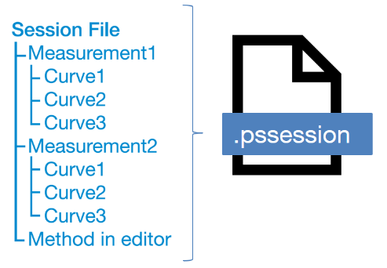

# Working with files

PyPalmSens and PSTrace store measurements and their corresponding methods in `.pssession` files. Methods can also be stored seperately in `.psmethod` files. `pypalmsens` contains all the functions needed to work with session and method files.

## Loading and saving a method file (`.psmethod`)

[pypalmsens.load_method_file][] can be used to load method files.
This returns a 'Method' dataclass with all the method parameters.

```python
import pypalmsens as ps

method = ps.load_method_file('examples/PSDummyCell_LSV.psmethod')
print(method)
"""
general=General(save_on_internal_storage=False, use_hardware_sync=False, notes='Use PSDummyCell WE_B (10 k Ohm 0.1%)', power_frequency=50) multiplexer=Multiplexer(mode='none', channels=[], connect_sense_to_working_electrode=False, combine_reference_and_counter_electrodes=False, use_channel_1_reference_and_counter_electrodes=False, set_unselected_channel_working_electrode=0) data_processing=DataProcessing(smooth_level=0, min_height=0.001, min_width=0.05) measurement_triggers=MeasurementTriggers(d0=False, d1=False, d2=False, d3=False) equilibrion_triggers=EquilibrationTriggers(d0=False, d1=False, d2=False, d3=False) ir_drop_compensation=IrDropCompensation(resistance=None) current_limits=CurrentLimits(max=None, min=None) post_measurement=PostMeasurement(cell_on_after_measurement=False, standby_potential=-0.5, standby_time=0.0) bipot=BiPot(mode='constant', potential=1.0, current_range=BiPotCurrentRange(max='1uA', min='1uA', start='1mA')) versus_ocp=VersusOCP(mode=0, max_ocp_time=1.0, stability_criterion=0.0) pretreatment=Pretreatment(deposition_potential=0.0, deposition_time=0.0, conditioning_potential=0.0, conditioning_time=0.0) current_range=CurrentRange(max='1mA', min='100nA', start='100uA') equilibration_time=2.0 begin_potential=-5.0 end_potential=5.0 step_potential=0.01 scanrate=1.0 enable_bipot_current=False record_auxiliary_input=False record_cell_potential=False record_we_potential=False id='lsv'
"""
```

Save the method using [pypalmsens.save_method_file][].

```python
ps.save_method_file('my_LSV.psmethod', method)
```

## Loading and saving data

{ width="80%" }

Data from measurements can be loaded from and stored to `.pssession` files.
This contains a session with one or more measurements containing its respective method and curves.

[pypalmsens.load_session_file][] can be used to load session files.
It returns a list of measurements, which contains the dataset and curves.
The dataset is a list of raw data in array form, whereas the curves resemble the plots.
In PSTrace or PSTrace Express these would be the 'Data' and the 'Plot' tab, respectively.

The exceptions are (galvanostatic) electrochemical impedance spectroscopy measurements, which contain additional plots.

The measurement and curve classes are defined in the `.curves` attribute, the raw data by the `.dataset` attribute, and the EIS data by the `.eis_data` attribute.

The following example loads a collection of measurements from a session file and saves the first measurement to a different file.

```python
from pypalmsens import load_session_file

measurements = load_session_file('examples/Demo CV DPV EIS IS-C electrode.pssession')

print(measurements)
"""
[Measurement(title=Differential Pulse Voltammetry, timestamp=2017-07-12T14:28:58, device=PalmSens4), Measurement(title=Cyclic Voltammetry [1], timestamp=2017-07-12T14:33:10, device=PalmSens4), Measurement(title=Impedance Spectroscopy [2], timestamp=2017-07-12T14:48:42, device=PalmSens4)]
"""

ps.save_session_file('my_measurement.pssession', measurements)
```
