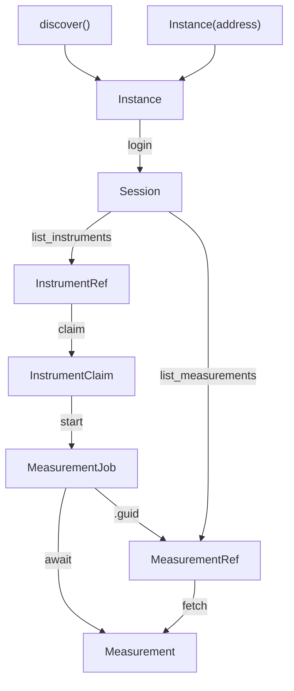

# Lablink Core Concepts

The Lablink API is built around a small, consistent vocabulary. Once you know the pattern, every part of the API follows it.

## References, handles, and data

Every object the API gives you falls into one of three categories:

1. References — lightweight snapshots of things that live on the Lablink server. A reference carries no measurement data, just an identifier and some metadata. They are safe to store and print. Reference classes end in `Ref` (plus `Instance`).
2. Handles — live objects with capabilities and a lifecycle. They do things: a `Session` holds an authenticated connection, an `InstrumentClaim` holds an exclusive claim on an instrument, a `MeasurementJob` tracks a running measurement.
3. Data — the payload itself, like a `Measurement`. You get data by fetching: resolving a reference or job into the real thing, which costs a network round-trip and transfers the payload.

```python
refs = await session.list_measurements()   # list[MeasurementRef] — cheap rows
old = await refs[0].fetch()                # Measurement — the actual data
```

Rule of thumb: if the name ends in `Ref`, it's a pointer you can hold onto. If it's a `Session`, `Claim`, or `Job`, it's a live handle with a lifecycle. If it's a bare noun like `Measurement`, it's the data.

## The type vocabulary

| Type | Category | What it is | How you get it |
|---|---|---|---|
| `Instance` | Reference | A Lablink server: its address plus metadata | `await discover()` or `Instance('http://127.0.0.1/')` |
| `Session` | Handle | An authenticated connection to an instance. The root object — everything else hangs off it. | `await instance.login(user, password)` |
| `InstrumentRef` | Reference | A pointer to an instrument (name, serial number, status) | `await session.list_instruments()` |
| `InstrumentClaim` | Handle | An exclusive lease on an instrument. While you hold it, no one else can use that instrument. | `await session.claim(instrument)` |
| `MeasurementJob` | Handle | A handle to a running measurement. Awaitable: `await job` blocks until it finishes. | `await session.start(claim, method)` |
| `MeasurementRef` | Reference | A pointer to a stored measurement (a row in the measurement table) | `await session.list_measurements()` |
| `Measurement` | Data | The actual measurement data | `await job` or `await ref.fetch()` |

### Lifecycle of a measurement



The crucial design decision: starting a measurement returns immediately. `session.start()` kicks off the measurement on the server and gives you a `MeasurementJob` handle right away — it does not wait for the measurement to finish. This is what lets one workstation orchestrate many instruments at once. You decide when (or whether) to wait:

```python
job = await session.start(claim, method=method)   # returns immediately
# ... do other things, start more measurements ...
measurement = await job                           # blocks only now, until it finishes
```

Even if you never await the job, the measurement still runs and the server keeps its own record — you can find it later through `session.list_measurements()` and `MeasurementRef.fetch()`. A `MeasurementJob` is a convenience; the `Ref` path is the durable one.

## Claims: borrowing instruments

An `InstrumentClaim` is an exclusive lock. While you hold it, that instrument is yours; when you release it, it becomes available to others. Two rules follow:

1. Always release claims, otherwise the instrument stays locked for everyone.
2. Prefer `async with`, which releases automatically, even if an error occurs:

```python
async with await session.claim(instrument) as claim:
    job = await session.start(claim, method=method)
    measurement = await job
# claim released here, no matter what happened above
```

For manual control (e.g. a claim held for the lifetime of an application), call `claim.release()` yourself.

## Batches: many instruments at once

Operations come in singular/plural pairs. Batch calls work on every item at once:

```python
async with await session.claim_many(instruments) as claims:
    jobs = await session.start_many(claims, method=method)
    measurements = await asyncio.gather(*jobs)
```

Notes on batches:

- `claim_many` claims all instruments in a single server call.
- `claims` in the block above is the list of individual claims. When the block exits, every claim in the batch is released.
- `asyncio.gather(*jobs)` raises if any measurement fails. To handle failures per-instrument instead of aborting:

  ```python
  results = await asyncio.gather(*jobs, return_exceptions=True)
  ok      = [r for r in results if not isinstance(r, BaseException)]
  failed  = [r for r in results if isinstance(r, BaseException)]
  ```

## Conventions

- Async methods do I/O. Anything that talks to the server or an instrument is `await`-able. Anything cheap and local (metadata on a `Ref`, properties on a `Measurement`) is a plain attribute.
- `list_*` methods return references. `session.list_measurements()` gives you pointers to rows. Call `.fetch()` on one to get the data.
- Everything prints usefully. `print(ref)` shows the serial number, GUID, or address.
