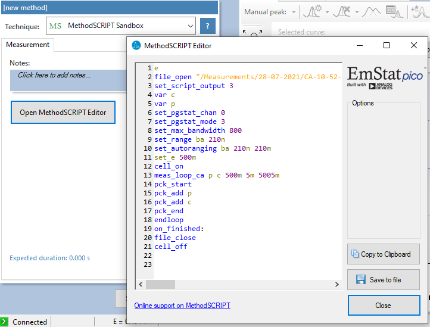

# Connecting and Measuring

The following chapter details how to connect to a device, read data from the device, manually controlling the potential, run measurements on the device and finally how to properly close a connection to a device.

The [pypalmsens](reference/index.md) top-level module contains all the relevant functions and classes for discovering and controlling instruments.
The [pypalmsens.InstrumentManager][] and [pypalmsens.InstrumentManagerAsync][]) class are wrappers around the PalmSens .NET libraries to connect to and control your instrument from Python.

!!! CAUTION "Mains Frequency"

    To eliminate noise induced by other electrical appliances it is highly recommended to set your regional mains frequency (50/60 Hz) in the general settings when performing a measurement `ps.settings.General.power_frequency`.

## Getting started

The simplest way to run an expirement is to use [pypalmsens.measure][].
This function connects to any plugged-in USB device it can find and starts the given measurement.

```py
import pypalmsens as ps

method = ps.ChronoAmperometry(
    interval_time=0.01,
    potential=1.0,
    run_time=5.0,
)

measurement = ps.measure(method) # (1)!
print(measurement)
"""
Measurement(title=Chronoamperometry, timestamp=2026-08-04T14:43:29, device=EmStat4LR)
"""
```

1. `measure` discovers any plugged-in device to start the measurement. An error is raised when more than 1 instruments are connected.

You can optionally pass the instrument to measure on if you have multiple connected.

```py
instruments = ps.discover()
first_instrument = instruments[0]

measurement = ps.measure(method, instrument=first_instrument)
print(measurement)
"""
Measurement(title=Chronoamperometry, timestamp=2026-08-04T14:43:31, device=EmStat4LR)
"""
```

## Connecting to a device

The recommended way to connect to a device for most workflows is to use the `ps.connect()` [context manager](https://docs.python.org/3/library/stdtypes.html#typecontextmanager).
The contextmanager manages the connection, and closes the connection to the device if it is no longer needed.
[pypalmsens.connect][] returns an instance of [pypalmsens.InstrumentManager][], which can be used to control the instrument and start a measurement:

```py
import pypalmsens as ps

with ps.connect() as manager:
    measurement = manager.measure(method)
```

By default, [pypalmsens.connect][] connects to any plugged-in USB instrument it discovers.
It gives an error when multiple instruments are discovered.
With more instruments connected, you can use [pypalmsens.discover][] to find all devices and manage them yourself.
For example, this is how to get a list of all available devices, and how to connect to the first one.

```py
available_instruments = ps.discover()
print(available_instruments)
#> [Instrument(name='EmStat4 LR [1]', interface='usbcdc')]

first_instrument = available_instruments[0]

with ps.connect(first_instrument) as manager:
   measurement = manager.measure(method)
```

Finally, you can set up the [pypalmsens.InstrumentManager][] yourself.

```py
available_instruments = ps.discover()
manager = ps.InstrumentManager(available_instruments[0])
manager.connect()
```

 [pypalmsens.InstrumentManager.disconnect][] disconnects from the device freeing it up for other things to connect to it.

```py
manager.disconnect()
```

Currently PyPalmSens supports discovering instruments connected via FTDI, serial (usbcdc/com), and Bluetooth (classic/low energy). By default scanning with Bluetooth is disabled.

You can enable scanning with Bluetooth by setting:

```py test="skip"
ps.discover(bluetooth=True)
```

### Connecting to a serial port

For general use, we recommend to use the [discover][pypalmsens.discover] functions to find specific devices.
The automatic device discovery uses pre-defined metadata (e.g. VID, PID for USB devices) to detect PalmSens devices.

If this does not fit your workflow, you can use the [pypalmsens.Instrument][] class to manually set the serial port to connect to.

The example below shows how to connect to the 'COM4' port on Windows:

```py test="skip"
import pypalmsens as ps

instrument = ps.Instrument.from_port('COM4')
print(instrument)
#> Instrument(name='COM4', interface='serialport')
with ps.connect(instrument) as manager:
    print(manager.get_instrument_serial())
    #> ES4HR20B0008
```

On Windows, you can see the connected devices using:

```powershell
$ reg query HKLM\HARDWARE\DEVICEMAP\SERIALCOMM

HKEY_LOCAL_MACHINE\HARDWARE\DEVICEMAP\SERIALCOMM
    \Device\USBSER000    REG_SZ    COM4
```

On linux you can query `/dev/serial` for serial devices, e.g.:

```bash
$ ls /dev/serial/by-id/
usb-PalmSens_EmStat4_ES4HR20B0008-if00
```

And pass the full device path to PyPalmSens:

```py
instrument = ps.Instrument.from_port('/dev/serial/by-id/usb-PalmSens_EmStat4_ES4HR20B0008-if00')
print(instrument)
"""
Instrument(
    name='/dev/serial/by-id/usb-PalmSens_EmStat4_ES4HR20B0008-if00',
    interface='serialport',
)
"""
```

!!! Note "Port stability"

    The serial port or device path your device gets assigned is not stable.
    It can change after a reboot or unplugging your device.

### Connecting via ethernet

Some devices, like the [PalmSens Nexus](https://www.palmsens.com/nexus/), can connect via ethernet over TCP/IP.

Make sure your computer running PyPalmSens is on the same network.

You can use the [pypalmsens.Instrument][] class to manually set the IP address to connect to.
The Nexus displays its IP in the display.

The example below shows how to connect to a Nexus with IP address '192.168.0.123':

```py test="skip"
import pypalmsens as ps

instrument = ps.Instrument.from_ip('192.168.0.123')
print(instrument)
#> Instrument(name='192.168.0.123', interface='tcp')
with ps.connect(instrument) as manager:
    print(manager.get_instrument_serial())
    #> NEXUS24C0029
```

### Connection issues

In some cases, devices may fail to connect via USB at seemingly random moments with the following error message:

```
Palmsens connection error: Device not recognized
```

This error means that the channel has been discovered, the connection has been opened, but that it was somehow not possible to send/receive data.
This can happen when there is some interference. Especially when establishing a connection there is a lot of back-and-forth communication, so chances of interference are the largest.
Unfortunately, there is no guarantee that the USB connection is stable with every PC configuration.

However, there are some precautions you can take.

1. Use the original USB cable as some other cables may not be properly shielded.
2. If you connect a MultiPalmSens4 via USB, wait at least 30s up to a minute before connecting after turning it on.

In most cases, you can simply retry connecting to the device or the channels.
If you are using an `InstrumentPool`, you can increase the number of attempts to establish the connection, see [InstrumentPool.connect][pypalmsens.InstrumentPool.connect] / [InstrumentPoolAsync.connect][pypalmsens.InstrumentPoolAsync.connect].

## Measuring

Starting a measurement is done by sending method parameters to a PalmSens/Nexus/EmStat/Sensit device.
The [pypalmsens.InstrumentManager.measure][] method returns a `Measurement` object and also supports keeping a reference to the underlying .NET object.
For more information please refer to [PalmSens.Net.Core](https://dev.palmsens.com/dotnet/api/core.html).

The following example runs a chronoamperometry measurement on an instrument.

```py
import pypalmsens as ps

method = ps.ChronoAmperometry(
    interval_time=0.01,
    potential=1.0,
    run_time=5.0
)

with ps.connect() as manager:
    measurement = manager.measure(method)
```

### Callback

You process measurement results in real-time by specifying a callback function as argument.
In the example below we use `print` to simply log the data to the console:

```py
with ps.connect() as manager:
    manager.measure(method, callback=print)
"""
{'index': 0, 'x': 0.0,  'y': -305.055}
{'index': 1, 'x': 0.01, 'y': -731.741}
{'index': 2, 'x': 0.02, 'y': -751.552}
...
"""
```

The callback is passed a collection of points that have been added since the last time it was called.
Thus, `new_data` below is a batched list of points, so we can expand the `print` example to print each point on a new line:

```py
def callback(data):
   print({'start': data.start, 'x': data.x[data.start:], 'y': data.y[data.start:]})

with ps.connect() as manager:
    manager.measure(method, callback=callback)
#> {'start': 0, 'x': [0.00, 0.01, 0.02], 'y': [-305.055, -740.935, -750.604]}
```

Alternatively, you can use `data.last_datapoint()` or `data.new_datapoints()` to get a dictionary with new data since the last callback.

Since `data.x` and `data.y` are of the [pypalmsens.data.DataArray] type, you can access these directly for your own code.
`data.start` is an index pointing at the first at the first element of the array, and `data.index` at the last.
The data arrays contain the complete data for the measurement. See [pypalmsens.data.CallbackData][] for more information.

The type of data returned depends on the measurement.
For non-impedemetric technique, this will be time (s), potential (V), or current (μA) for x, and current (μA) or potential (V) for y.
Query the data array directly (`DataArray.unit`, `DataArray.quantity`) for these data.

For impedemetric techniques, the callback returns the EIS [Dataset](data.md#dataset). See [pypalmsens.data.CallbackDataEIS][] for more information.

```py
def callback(data):
   print(data.last_datapoint())
   #> {'index': 1, 'x': 0.009999999776482582, 'y': 99.971728}
   #> {'index': 6, 'x': 0.05999999865889549, 'y': 99.968184}
   #> {'index': 12, 'x': 0.11999999731779099, 'y': 99.96592}
   #> {'index': 19, 'x': 0.1899999976158142, 'y': 99.96788}
   #> {'index': 25, 'x': 0.25, 'y': 99.968856}
   #> {'index': 31, 'x': 0.3100000023841858, 'y': 99.96851199999999}
   #> {'index': 38, 'x': 0.3799999952316284, 'y': 99.96148799999999}
   #> {'index': 44, 'x': 0.4399999976158142, 'y': 99.96923199999999}
   #> {'index': 50, 'x': 0.5, 'y': 99.96776799999999}
   #> {'index': 57, 'x': 0.5699999928474426, 'y': 99.969376}
   #> {'index': 63, 'x': 0.6299999952316284, 'y': 99.968464}
   #> {'index': 69, 'x': 0.6899999976158142, 'y': 99.974648}
   #> {'index': 76, 'x': 0.7599999904632568, 'y': 99.968864}
   #> {'index': 82, 'x': 0.8199999928474426, 'y': 99.97068}
   #> {'index': 89, 'x': 0.8899999856948853, 'y': 99.971344}
   #> {'index': 95, 'x': 0.949999988079071, 'y': 99.97232}
   #> {'index': 100, 'x': 1.0, 'y': 99.969848}

eismethod = ps.ElectrochemicalImpedanceSpectroscopy()

with ps.connect() as manager:
    manager.measure(method, callback=callback)
#> {'index': 0, 'Idc': -5.683012, 'potential': 0.0, 'time': 0.0024332, 'Frequency': 10000.0, 'ZRe': 4846.639, 'ZIm': -31990.538, 'Z': 32355.593, 'Phase': -81.385, 'Iac': 0.015, 'miDC': -5.683, 'mEdc': 0.598, 'Eac': 0.000, 'Y': 3.090e-05, 'YRe': 4.629e-06, 'YIm': -3.055e-05, 'Capacitance': -4.975e-10, "Capacitance'": -4.863e-10, "Capacitance''": 7.368e-11}
```

## Idle status updates

When idle or during pretreatment, the instrument measures and publishes the current, voltage, device state, etc when a datapoint is measured.
You can register a callback to subscribe to these events.
The event is fired every second and every 0.25 seconds during pretreatment.

!!! NOTE "Async"

    The callback requires an active event loop and therefore only works in Async mode.

For example, using print as the callback prints the status to the terminal:

```py
import pypalmsens as ps
import asyncio

async def main():
    async with await ps.connect_async() as manager:
        handle = manager.on_receive_status(print)
        await asyncio.sleep(3)  # (1)!
        #> {'state': 'Idle', 'current': '0.000 * 1uA', 'potential': '0.527 V'}
        #> {'state': 'Idle', 'current': '0.000 * 1uA', 'potential': '0.526 V'}
        #> {'state': 'Idle', 'current': '0.000 * 1uA', 'potential': '0.526 V'}
        handle.cancel()

asyncio.run(main())
```

1. Sleep is used here to simulate another task

The callback returns a [pypalmsens.data.Status][] object, which can be used to customize the behaviour.

For example, to print data during the pretreatment phases:

```py
def callback(status):
    if status.device_state == 'Pretreatment':
        print(f'{status.pretreatment_phase}: potential={status.potential:.3f} V, current={status.current:.3f} μA')
        #> Conditioning: potential=0.500 V, current=49.962 μA
        #> Conditioning: potential=0.500 V, current=49.961 μA
        #> Conditioning: potential=0.500 V, current=49.965 μA
        #> Conditioning: potential=0.500 V, current=49.966 μA
        #> Conditioning: potential=0.500 V, current=49.963 μA
        #> Conditioning: potential=0.500 V, current=49.960 μA
        #> Conditioning: potential=0.500 V, current=49.964 μA
        #> Conditioning: potential=0.500 V, current=49.960 μA
        #> Conditioning: potential=0.500 V, current=49.962 μA
        #> Conditioning: potential=0.500 V, current=49.964 μA

async def main():
    async with await ps.connect_async() as manager:
        handle = manager.on_receive_status(callback)
        await manager.measure(ps.ChronoAmperometry(
            pretreatment={'conditioning_time':2, 'conditioning_potential': 0.5},
        ))
        handle.cancel()

asyncio.run(main())
```

See [pypalmsens.data.Status][] or the provided [Status callback](examples.md#status-callback) example for more information.

## Receive messages

Likewise, you can register a callback for event messages.

These messages are like those in the status bar in PSTrace, and can include messages like:

- "Running: Cyclic Voltammetry"
- "Measuring cycle _x_ level _y_" for multistep techniques
- "Limit reached"

These are also emitted for a `send_string` call in MethodSCRIPT.

For example, using [print][] as the callback prints the messages to the terminal:

```py
import pypalmsens as ps
import asyncio

method = ps.MethodScript(script=('wait 100m\nsend_string "Hello world"'))

async def main():
    async with await ps.connect_async() as manager:
        handle = manager.on_receive_message(print)
        await manager.measure(method)
        #> Running: MethodSCRIPT Sandbox
        #> Hello world
        handle.cancel()

asyncio.run(main())
```

See [InstrumentManager][pypalmsens.InstrumentManager.on_receive_message] and [InstrumentManagerAsync][pypalmsens.InstrumentManagerAsync.on_receive_message] for more information.

## Manually controlling the device

Depending on your device’s capabilities it can be used to set a potential/current and to switch current ranges.
The potential can be set manually in potentiostatic mode and the current can be set in galvanostatic mode.

To turn the cell on or off:

```py test="skip"
manager.set_cell(True)
```

or off:

```py test="skip"
manager.set_cell(False)
```

You can switch current ranges, and read the current:

```py
with ps.connect() as manager:
    print(manager.supported_current_ranges())
    #> ['1nA', '10nA', '100nA', '1uA', '10uA', '100uA', '1mA', '10mA']

    manager.set_current_range('1uA')
    print(manager.get_current_range())
    #> 1uA

    print(manager.read_current())
    #> -0.00020947899611201137
```

Likewise you can switch potential ranges, and set/read the potential:

```py
with ps.connect() as manager:
    print(manager.supported_potential_ranges())
    #> ['50mV', '100mV', '200mV', '500mV', '1V']

    manager.set_potential_range('1V')
    print(manager.get_potential_range())
    #> 1V

    print(manager.read_potential())
    #> -0.00023021599918138236

    manager.set_potential(1)
```

See [`manual_control.py`](examples.md#manual-control) and [`manual_control_async.py`](examples.md#manual-control-async) for examples.

## MethodSCRIPT™

The MethodSCRIPT™ scripting language is designed to integrate PalmSens OEM potentiostat (modules) effortlessly in your hardware setup or product.

MethodSCRIPT™ allows you to program a human-readable script directly into the potentiostat module by means of a serial (TTL) connection.
The simple script language allows for running all supported electrochemical techniques and makes it easy to combine different measurements and other tasks.

More script features include:

* Use of variables
* (Nested) loops
* Logging results to an SD card
* Digital I/O for example for waiting for an external trigger
* Reading auxiliary values like pH or temperature
* Going to sleep or hibernate mode

See the [MethodSCRIPT™ documentation](https://dev.palmsens.com/msstart/methodscript_editors.html) for more information.

PSTrace includes a MethodSCRIPT™ Editor to write and run scripts.
This is a great place to test MethodSCRIPT™ measurements to see what the result would be.
That script can then be used in the [MethodScript][pypalmsens.MethodScript] technique in PyPalmSens.

{ width="80%" }

## Communication Protocol

Query the device directly using the [Communication Protocol](https://dev.palmsens.com/comm_es4/latest/comm/comm_main.html). This is supported on all MethodSCRIPT devices. The Communication Protocol is an interface with which you can send commands directly to the device, e.g. to access/manipulate the state of your device, setting registers, file operations, and sending scripts. These are implemented in these classes:

- [pypalmsens.CommProtocol][]
- [pypalmsens.CommProtocolAsync][]

For convenience, InstrumentManager exposes the primary [query][pypalmsens.InstrumentManager.query] method that sends a command and reads its response in one call:

```py
import pypalmsens as ps

with ps.connect() as manager:
    print(manager.query('i'))
    #> ES4LR20B0008

    print(manager.query('v'))
    #> 01.09.00

    print(manager.query('t'))
    """
    es4_lr1500#Mar 12 2026 14:28:01
    R*
    """

    script = 'e\nsend_string "Hello world!"\n\n'
    print(manager.query(script))
    """
    THello world!
    """
```

Asynchronous workflows are supported via [pypalmsens.InstrumentManagerAsync.query][].
For more information on the Communication Protocol and examples, see [the documentation here][./comm_protocol.md].


## Multichannel measurements

PyPalmSens supports multichannel experiments via [pypalmsens.InstrumentPool][] and [pypalmsens.InstrumentPoolAsync][].

This class manages a pool of instruments ([pypalmsens.InstrumentManagerAsync][]), so that one method can be executed on all instruments at the same time.

This works best with a multichannel device like the [MultiPalmSens4](https://www.palmsens.com/product/multipalmsens4/) or a [MultiEmStat4](https://www.palmsens.com/product/multi-emstat4/).
You can also use it to manage a collection of single devices

A basic multichannel measurement can be set up by passing a list of instruments, either from a multichannel device, or otherwise connected:

```py
instruments = ps.discover()

print(instruments)
#> [Instrument(name='EmStat4 LR [1]', interface='usbcdc')]

method = ps.CyclicVoltammetry()

with ps.InstrumentPool(instruments) as pool: # (1)!
   measurements = pool.measure(method)

print(measurements)
"""
[Measurement(title=Cyclic Voltammetry, timestamp=2026-08-04T14:44:01, device=EmStat4LR)]
"""
```

1. `InstrumentPool` is a context manager, so all instruments are disconnected after use.

The above example uses blocking calls for the instrument pool.
While this works well for many straightforward use-cases, the backend for multichannel measurements is asynchronous by necessity.
The rest of the documentation here focuses on the async version of the instrument pool, [pypalmsens.InstrumentPool][].
This is more powerful and more flexible for more demanding use cases.
Note that most of the functionality and method names are shared between [pypalmsens.InstrumentPool][] and [pypalmsens.InstrumentPoolAsync][].

```py
import pypalmsens as ps
import asyncio

async def main():
    instruments = await ps.discover_async()

    method = ps.CyclicVoltammetry()

    async with ps.InstrumentPoolAsync(instruments) as pool:
        measurements = await pool.measure(method)

    print(measurements)
    """
    [Measurement(title=Cyclic Voltammetry, timestamp=2026-08-04T14:44:04, device=EmStat4LR)]
    """

asyncio.run(main())
```

The pool takes a [Callback](#callback) in its `measure()` method, just like a regular [pypalmsens.InstrumentManager][].

```py test="skip"
async with ps.InstrumentPoolAsync(instruments) as pool:
   results = await pool.measure(method, callback=callback)
```

You can add ([pypalmsens.InstrumentPool.add][]) and remove ([pypalmsens.InstrumentPool.remove][]) managers from the pool:

```py test="skip"
serial_numbers = ['ES4HR20B0008', ...]

async with ps.InstrumentPoolAsync(instruments) as pool:
    for manager in pool:
       if await manager.get_instrument_serial() not in serial_numbers:
            await pool.remove(manager)
```

You can also manage the pool yourself by passing the _instrument managers_ directly:

```py test="skip"
instruments = await ps.discover_async()

managers = [
    ps.InstrumentManagerAsync(instrument) for instrument in instruments
]

async with ps.InstrumentPoolAsync(managers) as pool:
    pass  # pool operations
```

To define your own measurement functions, you can use the [pypalmsens.InstrumentPoolAsync][] method.
Pass a function that must take [pypalmsens.InstrumentManagerAsync][] as the first argument.
Any other keyword arguments will be passed on.

For example to run two methods in sequence:

```py test="skip"
async def my_custom_function(manager, *, method1, method2):
    measurement1 = await manager.measure(method1)
    measurement2 = await manager.measure(method2)
    return measurement1, measurement2

async with ps.InstrumentPoolAsync(instruments) as pool:
    results = await pool.submit(my_task, method=method)
```

See [CSV writer](examples.md#multichannel_csv_writer) and [Custom loop](examples.md#multichannel_custom_loop) examples for a practical example of setting a custom function.

### Hardware Synchronization

To use hardware synchronization, use the same `measure` method.

First, enable hardware sync on your method. PyPalmSens uses these flags to set up the main/follower channels and associated events.

- For most methods, you can use the `general.use_hardware_sync` flag
- For MethodSCRIPT, use `set_channel_sync 1` in your script. PyPalmSens checks for the presence of this string.

In addition, the pool must contain:

- channels from a single multichannel instrument only
- the first channel of the multichannel instrument
- at least two channels

All instruments are prepared and put in a waiting state.
The measurements are started via a hardware sync trigger on channel 1.

```py test="skip"
method.general.use_hardware_sync = True

async with ps.InstrumentPoolAsync(instruments) as pool:
     results = await pool.measure_hw_sync(method)
```

See [Hardware sync](examples.md#multichannel_hw_sync) for a practical example.

## Streaming data to a file

When measuring, PyPalmSens can auto-save all data directly to a file.
The stream can be used for:

1. Streaming data to other processes
2. Data recovery
3. Tracking long-running measurements

This option is especially useful for long-term measurements.
Auto-saving all data helps with data recovery.
In case of a PC crash or power outage, the most recent measurement data will still be available.

In addition, this enables streaming the data to another process for realtime analysis, e.g. monitoring live progress outside of the measurement process.

To enable streaming to a file, pass the name of the data file to the [measure][pypalmsens.measure] function

```py
import pypalmsens as ps

ps.measure(ps.CyclicVoltammetry(), stream='data.jsonl')
```

This will stream data directly to the file `data.json`.

Passing a file to stream to is also supported on [InstrumentManager.measure][pypalmsens.InstrumentManager.measure] and [InstrumentManagerAsync.measure][pypalmsens.InstrumentManagerAsync.measure].

The data stream is implemented using the [JSON lines data format](https://jsonlines.org/), which has 3 rules:

1. UTF-8 Encoding
2. Each line is a valid JSON value
3. Line terminator is `'\n'`

This means the data can be read in any programming language with a JSON parser.

!!! Note "Exporting to PSTrace"

    The data format was designed specifically for PyPalmSens. If you want to analyze your data in PSTrace, make sure to save the data to `.pssession` at the end of your measurement using [pypalmsens.save_session_file][].

### Load stream data

PyPalmSens contains a parser to load such files, [pypalmsens.load_stream_file][]. Although the data structure resembles that [pypalmsans.data.Measurement][], it it is much smaller in scope, and lacks some of the more advanced features.

```py
import pypalmsens as ps

_ = ps.measure(ps.CyclicVoltammetry(n_scans=3), stream='data.jsonl')
stream = ps.load_stream_file('data.jsonl')
print(stream)
#> Measurement(Cyclic Voltammetry, timestamp=2026-08-04 14:44:11, device=EmStat4LR)

print(stream.metadata.method)
"""
general=General(save_on_internal_storage=False, use_hardware_sync=False, notes='', power_frequency=50) data_processing=DataProcessing(smooth_level=0, min_height=0.0, min_width=0.1) measurement_triggers=MeasurementTriggers(d0=False, d1=False, d2=False, d3=False) equilibrion_triggers=EquilibrationTriggers(d0=False, d1=False, d2=False, d3=False) ir_drop_compensation=IrDropCompensation(resistance=None) current_limits=CurrentLimits(max=None, min=None) post_measurement=PostMeasurement(cell_on_after_measurement=False, standby_potential=0.0, standby_time=0.0) bipot=BiPot(mode='constant', potential=0.0, current_range='1uA') versus_ocp=VersusOCP(mode=0, max_ocp_time=20.0, stability_criterion=0.0) pretreatment=Pretreatment(deposition_potential=0.0, deposition_time=0.0, conditioning_potential=0.0, conditioning_time=0.0) current_range=CurrentRange(max='10mA', min='1uA', start='100uA') equilibration_time=0.0 begin_potential=-0.5 vertex1_potential=0.5 vertex2_potential=-0.5 step_potential=0.1 scanrate=1.0 n_scans=3 enable_bipot_current=False record_auxiliary_input=False record_cell_potential=False record_we_potential=False id='cv'
"""

print(stream.curves)
"""
[Curve(CV i vs E Scan 1, n_points=20), Curve(CV i vs E Scan 2, n_points=20), Curve(CV i vs E Scan 3, n_points=21)]
"""

print(stream.curves[0].metadata)
"""
CurveMetadata(
    title='CV i vs E Scan 1',
    columns=['x', 'y'],
    units=['V', 'µA'],
    labels=['Potential', 'Current'],
    id=18823110,
    type='curve',
)
"""

print(stream.curves[0].data)
"""
[
    [-0.49998899999999996, -50.015384],
    [-0.400011, -40.012924],
    [-0.300033, -30.022095999999998],
    [-0.20005599999999998, -20.025534],
    [-0.10007779200000001, -10.022376999999999],
    [-0.000100077792, -0.027780672000000003],
    [0.09987763200000001, 9.95523],
    [0.19985499999999998, 19.975336],
    [0.29983299999999996, 29.964527999999998],
    [0.39981099999999997, 39.941744],
    [0.499789, 49.943808],
    [0.39981099999999997, 39.941336],
    [0.29983299999999996, 29.947993999999998],
    [0.19985499999999998, 19.952626],
    [0.09987763200000001, 9.951841],
    [-0.000100077792, -0.033328842000000004],
    [-0.10007779200000001, -10.0255],
    [-0.20005599999999998, -20.005062],
    [-0.300033, -29.940496],
    [-0.400011, -40.007976],
]
"""
```

### Data format

The data are self-documenting. At the top of each file, PyPalmSens writes the Measurement metadata. This block contains the timestamp, device, method parameters, firmware version, and library version.

For impedance measurements, the start of each EIS measurement starts with an 'EIS metadata' block. For non-impedance measurements, each curve starts with a Curve metadata block.

These contain the title, column headers, units, labels, and other data metadata. The `id` field is used to link the data rows back to the curve or eis metadata.

The majority of the lines will be rows of data, including an `id` field which can be used to match the corresponding curve / eis data and a `data` field containing a list of data values. The number of columns matches the `columns` / `units` / `quantities` lists in the metadata.

!!! Note "Feedback"

    The data stream and documentation are [under development](https://github.com/palmsens/palmsens-sdk/issues/392), and we intend to provide tooling to read the data, as well as more options to the data stream and callback system.

    We welcome your feedback! Please open an issue on the [PyPalmSens repository](https://github.com/palmsens/palmsens-sdk) for thoughts, requests, or suggestions.
