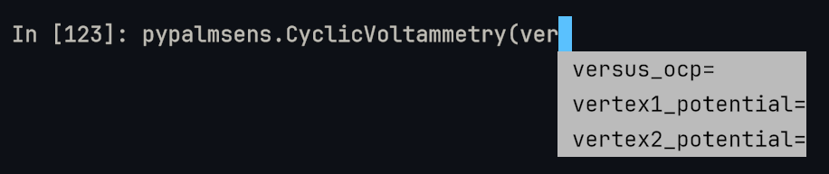

# Methods

## Supported Methods

The following methods are available in PyPalmSens:

**Voltammetric Techniques**

- [Linear Sweep Voltammetry][pypalmsens.LinearSweepVoltammetry]
- [Cyclic Voltammetry][pypalmsens.CyclicVoltammetry]
- [Fast Cyclic Voltammetry][pypalmsens.FastCyclicVoltammetry]
- [AC Voltammetry][pypalmsens.ACVoltammetry]

**Pulsed Techniques**

- [Differential Pulse Voltammetry][pypalmsens.DifferentialPulseVoltammetry]
- [Square Wave Voltammetry][pypalmsens.SquareWaveVoltammetry]
- [Normal Pulse Voltammetry][pypalmsens.NormalPulseVoltammetry]

**Amperometric Techniques**

- [Chronoamperometry][pypalmsens.ChronoAmperometry]
- [Multistep Amperometry][pypalmsens.MultiStepAmperometry]
- [Fast Amperometry][pypalmsens.FastAmperometry]
- [Pulsed Amperometric Detection][pypalmsens.PulsedAmperometricDetection]
- [Multiple Pulse Amperometry][pypalmsens.MultiplePulseAmperometry]

**Potentiometric Techniques**

- [Open Circuit Potentiometry][pypalmsens.OpenCircuitPotentiometry]
- [Chronopotentiometry][pypalmsens.ChronoPotentiometry]
- [Linear Sweep Potentiometry][pypalmsens.LinearSweepPotentiometry]
- [Multistep Potentiometry][pypalmsens.MultiStepPotentiometry]
- [Stripping Chronopotentiometry][pypalmsens.StrippingChronoPotentiometry]

**Coulometric Techniques**

- [Chronocoulometry][pypalmsens.ChronoCoulometry]

**Other Techniques**

- [Impedance Spectroscopy][pypalmsens.ElectrochemicalImpedanceSpectroscopy]
- [Fast Impedance Spectroscopy][pypalmsens.FastImpedanceSpectroscopy]
- [Galvanostatic Impedance Spectroscopy][pypalmsens.GalvanostaticImpedanceSpectroscopy]
- [Fast Galvanostatic Impedance Spectroscopy][pypalmsens.FastGalvanostaticImpedanceSpectroscopy]
- [Mixed Mode][pypalmsens.MixedMode]
- [Method Script][pypalmsens.MethodScript] | [Stages][pypalmsens.stages]

## Setting up a Method

Here is an example of creating a method for a [square-wave voltammetry][pypalmsens.SquareWaveVoltammetry] measurement versus the open circuit potential:

```pycon
>>> import pypalmsens as ps

>>> method = ps.SquareWaveVoltammetry(
...    pretreatment={
...        'conditioning_potential': 2.0,  # V
...        'conditioning_time': 2,  # seconds
...    },
...    versus_ocp={
...        'mode': 3,  # versus begin and end potential
...        'max_ocp_time': 1,  # seconds
...    },
...    begin_potential=-0.5,  # V
...    end_potential=0.5,  # V
...    step_potential=0.01,  # V
...    amplitude=0.08,  # V
...    frequency=10,  # Hz
... )

```

Since methods are built on [Pydantic models](https://docs.pydantic.dev/latest/), you can easily modify their attributes after creation:

```pycon
>>> method.begin_potential = -1.0
>>> method.end_potential = 1.0
>>> method.step_potential = 0.02

```

Methods can also be converted to and from a dictionary:

```pycon
>>> dumped = method.model_dump()
>>> dumped
{..., 'equilibration_time': 0.0, 'begin_potential': -1.0, 'end_potential': 1.0, 'step_potential': 0.02, 'frequency': 10.0, 'amplitude': 0.08, ...}
>>> method2 = ps.SquareWaveVoltammetry(**dumped)
>>> method == method2
True

```

To copy a method and make updates, use `model_copy`:

```pycon
>>> method3 = method.model_copy(update={'equilibration_time': 10.0})
>>> method == method3
False

```

!!! Tip: Code Completion

    The VSCode Debug Console or other Python REPL environments like [IPython](https://ipython.readthedocs.io) will offer auto-completion for properties and functions.

    { width="80%" }


### Common settings

Many settings are shared across methods.
For a complete list, please refer to [`pypalmsens.settings`](reference/methods/settings.md).

If you don't provide any arguments, the default values will be loaded automatically.
These defaults can be accessed directly via attributes on the method instance.

For example:

```pycon
>>> cv = ps.CyclicVoltammetry()
>>> cv.current_range
CurrentRange(max='10mA', min='1uA', start='100uA')

```

You have two ways to set the current range, for instance, if you want to set the start current to 10 μA.

1. By passing current ranges as an argument during initialization

    ```pycon
    >>> cv = ps.CyclicVoltammetry(current_range={'start': '10uA'})
    >>> cv.current_range   # (1)!
    CurrentRange(max='10mA', min='1uA', start='10uA')

    ```

    1. Only the start value was set, so the min/max are populated with the defaults.

2. By updating the attributes after initialization

    ```pycon
    >>> cv = ps.CyclicVoltammetry()
    >>> cv.current_range.start = '10uA'

    ```

!!! TIP "Fixed ranges"

    If you need to use a fixed current (or potential) range, you can simplify the code by passing the current range string directly. This automatically sets `min`, `max`, and `start` to the same value.

    ```pycon
    >>> cv = ps.CyclicVoltammetry(current_range='10uA')
    >>> cv.current_range
    CurrentRange(max='10uA', min='10uA', start='10uA')

    ```

### Validation

Methods are defined as [Pydantic Models](https://docs.pydantic.dev/latest/concepts/models/).
Pydantic is a library for defining a schema via models.
They are very similar to [Python dataclasses](https://docs.python.org/3/library/dataclasses.html#module-dataclasses) in the way that they work.

The important difference is that Pydantic offers more options for [validation, serialization, and conversion](https://docs.pydantic.dev/latest/concepts/dataclasses/).

This means is automatically converts dictionaries to the correct type (if the fields can be matched), for example:

```pycon
>>> import pypalmsens as ps

>>> cv = ps.CyclicVoltammetry(
...     current_range = {'min':'10mA', 'max':'1uA', 'start':'100uA'}
... )
>>> cv.current_range
CurrentRange(max='1uA', min='10mA', start='100uA')

```

And gives an errorr when trying to overwrite types by invalid dictionaries or instances:

```pycon
>>> cv.current_range='foo'
Traceback (most recent call last):
ValidationError: 3 validation errors for CyclicVoltammetry
current_range.max
  Input should be '100pA', '1nA', ... or '1A' [type=literal_error, input_value='foo', input_type=str]
    For further information visit https://errors.pydantic.dev/2.13/v/literal_error
current_range.min
  Input should be '100pA', '1nA', ... or '1A' [type=literal_error, input_value='foo', input_type=str]
    For further information visit https://errors.pydantic.dev/2.13/v/literal_error
current_range.start
  Input should be '100pA', '1nA', ... or '1A' [type=literal_error, input_value='foo', input_type=str]
    For further information visit https://errors.pydantic.dev/2.13/v/literal_error

```

It is also helps prevents setting non-existant variables and guard against typos:

```pycon
>>> cv = ps.CyclicVoltammetry(foo=123, scanreat=2.0)
Traceback (most recent call last):
ValidationError: 2 validation errors for CyclicVoltammetry
foo
  Extra inputs are not permitted [type=extra_forbidden, input_value=123, input_type=int]
    For further information visit https://errors.pydantic.dev/2.13/v/extra_forbidden
scanreat
  Extra inputs are not permitted [type=extra_forbidden, input_value=2.0, input_type=float]
    For further information visit https://errors.pydantic.dev/2.13/v/extra_forbidden

```

['Strict' mode](https://docs.pydantic.dev/latest/concepts/strict_mode/) helps catching variable errors, for example when you set a string when a number (float) is expected:

```pycon
>>> cv = ps.CyclicVoltammetry(scanrate='1.0')
Traceback (most recent call last):
ValidationError: 1 validation error for CyclicVoltammetry
scanrate
  Input should be a valid number [type=float_type, input_value='1.0', input_type=str]
    For further information visit https://errors.pydantic.dev/2.13/v/float_type

```

It also prevents setting non-existant attributes:

```pycon
>>> cv.scanreat=1.0
Traceback (most recent call last):
ValidationError: 1 validation error for CyclicVoltammetry
scanreat
  Object has no attribute 'scanreat' [type=no_such_attribute, input_value=1.0, input_type=float]
    For further information visit https://errors.pydantic.dev/2.13/v/no_such_attribute

```

Or unexpected values:

```pycon
>>> cp = ps.ChronoPotentiometry(applied_current_range='1GA')
Traceback (most recent call last):
ValidationError: 1 validation error for ChronoPotentiometry
applied_current_range
  Input should be '100pA', '1nA', ... or '1A' [type=literal_error, input_value='1GA', input_type=str]
    For further information visit https://errors.pydantic.dev/2.13/v/literal_error

```

## Starting a measurement

For further information on how to run a measurement:

* [Measuring](measuring.md)
* [Examples](examples.md)
